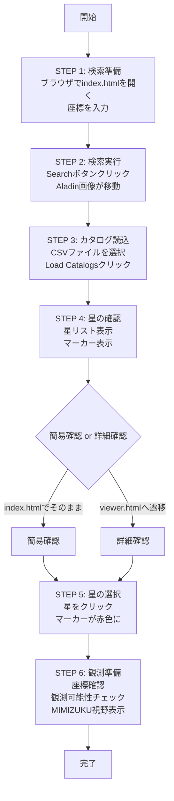
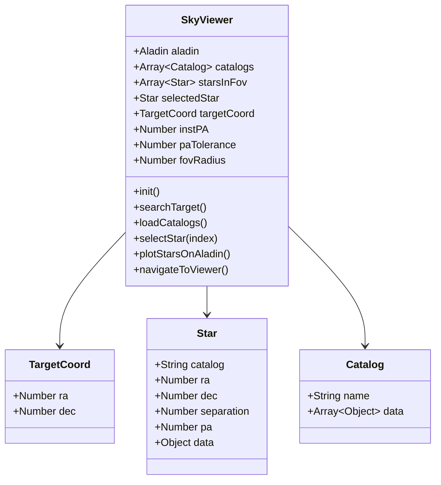
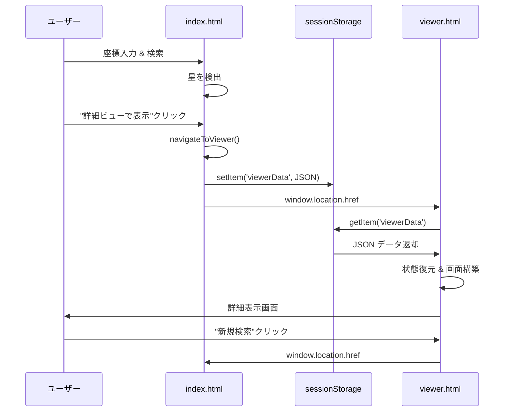

# Webアプリケーションの構成図・設計図・使用手順図

## 概要

本ドキュメントは、天体観測支援Webアプリケーション「Sky Viewer」の構成図、設計図、および使用手順を示す概念図を提供します。論文での説明用に作成されています。

---

## 1. システムアーキテクチャ図

### 1.1 全体システム構成

```
┌─────────────────────────────────────────────────────────────────┐
│                         ユーザー（天文学者）                        │
└────────────────────────┬────────────────────────────────────────┘
                         │ Webブラウザ
                         ↓
┌─────────────────────────────────────────────────────────────────┐
│                    Sky Viewer Webアプリケーション                  │
│  ┌──────────────────────────────────────────────────────────┐  │
│  │              フロントエンド（クライアントサイド）              │  │
│  │                                                            │  │
│  │  ┌────────────────┐  ┌──────────────────┐                │  │
│  │  │  index.html    │  │   viewer.html    │                │  │
│  │  │  (検索ページ)  │  │  (詳細表示ページ) │                │  │
│  │  └───────┬────────┘  └────────┬─────────┘                │  │
│  │          │                     │                          │  │
│  │          └─────────┬───────────┘                          │  │
│  │                    │                                      │  │
│  │          ┌─────────▼──────────┐                           │  │
│  │          │      app.js        │                           │  │
│  │          │  (SkyViewerクラス) │                           │  │
│  │          └─────────┬──────────┘                           │  │
│  │                    │                                      │  │
│  │       ┌────────────┼────────────┐                         │  │
│  │       │            │            │                         │  │
│  │  ┌────▼────┐  ┌───▼────┐  ┌───▼────┐                    │  │
│  │  │ 座標計算 │  │カタログ │  │ UI制御 │                    │  │
│  │  │ モジュール│  │処理     │  │        │                    │  │
│  │  └─────────┘  └────────┘  └────────┘                    │  │
│  └──────────────────┬───────────────────────────────────────┘  │
│                     │                                          │
│            ┌────────┼────────┐                                 │
│            │        │        │                                 │
│    ┌───────▼──┐ ┌──▼────┐ ┌─▼──────────┐                     │
│    │ Session  │ │ Local │ │   File     │                     │
│    │ Storage  │ │Browser│ │  Upload    │                     │
│    │          │ │ State │ │  (CSV)     │                     │
│    └──────────┘ └───────┘ └────────────┘                     │
└─────────────────────────────────────────────────────────────────┘
                         │
        ┌────────────────┼────────────────┐
        │                │                │
┌───────▼────────┐ ┌────▼──────┐  ┌─────▼──────────┐
│  Aladin Lite   │ │ PapaParse │  │  html2canvas   │
│  v3 (CDN)      │ │  (CDN)    │  │    (CDN)       │
│  天体画像表示   │ │  CSV解析  │  │  PNG変換       │
└────────────────┘ └───────────┘  └────────────────┘
        │
        │ HTTP/HTTPS
        ↓
┌────────────────────────────────────────────────────┐
│          外部天体画像サーバー                        │
│  ・CDS (Centre de Données astronomiques de         │
│        Strasbourg)                                  │
│  ・2MASS, DSS2, AllWISE, SDSS9, PanSTARRS         │
└────────────────────────────────────────────────────┘
```

### 1.2 技術スタック

```
┌─────────────────────────────────────────────────────┐
│             フロントエンド技術スタック                 │
├─────────────────────────────────────────────────────┤
│  HTML5                                              │
│    ├─ index.html (検索インターフェース)              │
│    └─ viewer.html (結果表示インターフェース)         │
├─────────────────────────────────────────────────────┤
│  CSS3                                               │
│    ├─ Flexbox レイアウト                            │
│    ├─ レスポンシブデザイン                           │
│    └─ カスタムスタイリング (インライン)              │
├─────────────────────────────────────────────────────┤
│  JavaScript (ES6+)                                  │
│    ├─ app.js (メインアプリケーションロジック)        │
│    ├─ クラスベースアーキテクチャ                     │
│    └─ イベント駆動プログラミング                     │
├─────────────────────────────────────────────────────┤
│  外部ライブラリ (CDN)                                │
│    ├─ Aladin Lite v3 (天体画像表示)                │
│    ├─ PapaParse v5.4.1 (CSV解析)                   │
│    └─ html2canvas v1.4.1 (画像変換)                │
├─────────────────────────────────────────────────────┤
│  ブラウザAPI                                         │
│    ├─ sessionStorage (ページ間データ共有)           │
│    ├─ FileReader API (ファイル読み込み)             │
│    └─ Canvas API (画像処理)                         │
└─────────────────────────────────────────────────────┘
```

---

## 2. コンポーネント設計図

### 2.1 主要クラス構造

```
┌──────────────────────────────────────────────────────────┐
│                     SkyViewer クラス                      │
├──────────────────────────────────────────────────────────┤
│  プロパティ:                                              │
│    • aladin: Aladin Lite インスタンス                     │
│    • catalogs: 読み込まれた星カタログ配列                 │
│    • starsInFov: 視野内の星リスト                         │
│    • selectedStar: 選択された星                           │
│    • targetCoord: ターゲット座標 {ra, dec}                │
│    • instPA: 装置位置角                                   │
│    • paTolerance: P.A.許容範囲                            │
│    • fovRadius: 視野半径 (25分角)                         │
│    • magFilter: 等級フィルター設定                        │
├──────────────────────────────────────────────────────────┤
│  メソッド:                                                │
│    【初期化】                                             │
│    + init()                                              │
│    + initAladin()                                        │
│    + setupEventListeners()                               │
│    │                                                      │
│    【検索・表示】                                         │
│    + searchTarget()                                      │
│    + centerOnTarget(targetString)                        │
│    + findStarsInFov()                                    │
│    + displayStars()                                      │
│    + plotStarsOnAladin()                                 │
│    │                                                      │
│    【カタログ処理】                                       │
│    + loadCatalogs()                                      │
│    + parseCatalogFile(file)                              │
│    + detectAvailableColumns()                            │
│    + applyMagnitudeFilter()                              │
│    │                                                      │
│    【選択・観測】                                         │
│    + selectStar(index)                                   │
│    + confirmObservation()                                │
│    + showMimizukuDualField()                             │
│    │                                                      │
│    【P.A.制御】                                           │
│    + updatePA()                                          │
│    + drawRecommendedWedges()                             │
│    + isStarRecommended(pa)                               │
│    │                                                      │
│    【座標計算】                                           │
│    + calculateSeparation(ra1, dec1, ra2, dec2)           │
│    + calculatePositionAngle(ra1, dec1, ra2, dec2)        │
│    + calculateAltitudeAzimuth(ra, dec, lst, lat)         │
│    │                                                      │
│    【観測可能性】                                         │
│    + checkObservability()                                │
│    + findSunriseSunset(date, location)                   │
│    │                                                      │
│    【ナビゲーション】                                     │
│    + navigateToViewer()                                  │
└──────────────────────────────────────────────────────────┘
```

### 2.2 データモデル

```
┌─────────────────────────────────────────────────────────┐
│                    データ構造定義                          │
├─────────────────────────────────────────────────────────┤
│  TargetCoord                                            │
│  {                                                      │
│    ra: Number,      // 赤経 (度)                        │
│    dec: Number      // 赤緯 (度)                        │
│  }                                                      │
├─────────────────────────────────────────────────────────┤
│  Star                                                   │
│  {                                                      │
│    catalog: String,    // カタログ名                    │
│    ra: Number,         // 赤経 (度)                     │
│    dec: Number,        // 赤緯 (度)                     │
│    separation: Number, // ターゲットからの距離 (度)     │
│    pa: Number,         // 位置角 (度)                   │
│    data: Object        // カタログの生データ            │
│  }                                                      │
├─────────────────────────────────────────────────────────┤
│  Catalog                                                │
│  {                                                      │
│    name: String,       // ファイル名                    │
│    data: Array<Object> // CSVから読み込んだデータ       │
│  }                                                      │
├─────────────────────────────────────────────────────────┤
│  MagFilter                                              │
│  {                                                      │
│    band: String,       // 等級バンド名                  │
│    min: Number|null,   // 最小等級                      │
│    max: Number|null    // 最大等級                      │
│  }                                                      │
├─────────────────────────────────────────────────────────┤
│  ViewerData (sessionStorage)                            │
│  {                                                      │
│    targetCoord: TargetCoord,                            │
│    targetInput: String,                                 │
│    instPA: Number,                                      │
│    paTolerance: Number,                                 │
│    paRestrict: Boolean,                                 │
│    starsInFov: Array<Star>,                             │
│    availableColumns: Array<String>,                     │
│    magFilter: MagFilter                                 │
│  }                                                      │
└─────────────────────────────────────────────────────────┘
```


---

## 3. 主要な処理フロー図

### 3.1 基本的な検索・表示フロー

```
ユーザー入力 (座標)
      ↓
1. 座標解析 (parseCoordinates)
      ↓
2. Aladin画像移動 (centerOnTarget)
      ↓
3. 視野円描画 (drawFovCircle)
      ↓
4. P.A.制約表示 (drawRecommendedWedges)
      ↓
5. カタログから視野内の星を検索
   • 各カタログをループ
   • 距離計算 (Haversine)
   • 視野内(25分角以内)を抽出
   • 位置角を計算
   • ソート (距離順)
      ↓
6. UI更新
   • displayStars()
   • plotStarsOnAladin()
      ↓
結果表示完了
```

### 3.2 星選択とマーカー色変更フロー

```
ユーザー操作 (星をクリック)
      │
      ├── 表の星をクリック
      │
      └── Aladin画像上の星をクリック
            ↓ (Canvas座標から最近傍星を検出)
            ↓
selectStar(index) 実行
  • selectedIndex更新
  • selectedStar更新
      ↓
表示更新
  • displayStars(): 選択行に黄色枠
  • plotStarsOnAladin(): マーカーを赤色、サイズ16pxに
      ↓
ボタン有効化
  • "Observe with this star"
  • "MIMIZUKU View"
  • "Check Observability"
```

### 3.3 ページ遷移とデータ永続化フロー

```
index.html (検索ページ)
      ↓
検索実行 → 視野内の星を検出
      ↓
"詳細ビューで表示"ボタンクリック
      ↓
navigateToViewer()
  • 現在の状態を収集
  • sessionStorage.setItem('viewerData', JSON)
      ↓
window.location.href = 'viewer.html'
      ↓
viewer.html (結果ページ)
      ↓
ページ読み込み時
  • sessionStorage.getItem('viewerData')
  • JSON.parse()
  • 状態復元
  • 画面再構築
      ↓
"新規検索"ボタンクリック
      ↓
index.html に戻る
```

---

## 4. UI/UXレイアウト設計

### 4.1 index.html (検索ページ) レイアウト

```
┌────────────────────────────────────────────────────────────────┐
│                 コントロールパネル                              │
│ [Target入力] [Search] [詳細ビューで表示→]                      │
│ [P.A.設定] [Tolerance] [☑ Restrict] [Update]                  │
│ [カタログファイル選択] [Load Catalogs]                          │
│ [Survey選択] [Change Survey]                                   │
│ [Mag Filter] [Min~Max] [Apply]                                │
└────────────────────────────────────────────────────────────────┘
┌──────────────────────────┬─────────────────────────────────────┐
│                          │  Stars in FoV (25 arcmin)           │
│      Aladin 画像         ├─────────────────────────────────────┤
│      表示エリア          │  凡例: ○ 推奨星                     │
│   (可変幅、大きめ)       │  ────────────────────────────────── │
│                          │  ╔═ #1 星情報 ═╗                    │
│   • 視野円: 25分角       │  ║RA, Dec, PA, Sep ║                │
│   • P.A.制約: 黄色扇形   │  ╚═══════════════╝                  │
│   • マーカー色:          │  ┌─ #2 星情報 ─┐                    │
│     - 青: 通常の星       │  │RA, Dec, PA, Sep│                 │
│     - マゼンタ: 推奨星   │  └───────────────┘                  │
│     - 赤: 選択された星   │  (スクロール可能)                    │
└──────────────────────────┴─────────────────────────────────────┘
                          │  ▼ Observation Coordinates           │
                          │  [Observe] [MIMIZUKU View]           │
                          │  ▼ Observability Check               │
                          │  [日付] [観測所] [Check]              │
                          └─────────────────────────────────────┘
```

### 4.2 viewer.html (詳細表示ページ) レイアウト

```
┌────────────────────────────────────────────────────────────────┐
│  [← 新規検索] Target: 18h09m01.48s -20d05m08.0s               │
└────────────────────────────────────────────────────────────────┘
┌──────────────┬─────────────────────────────────────────────────┐
│  Aladin画像  │  Stars in FoV - 詳細表示                         │
│  (400px固定) ├─────────────────────────────────────────────────┤
│              │  凡例: ○推奨 □その他 ●選択                     │
│ ┌──────────┐ │  ━━━━━━━━━━━━━━━━━━━━━━━━━━━━━━━━━━━━━━━━━━ │
│ │          │ │  ╔═ #1 詳細情報 ═══════════════════════════╗ │
│ │ ○ Target │ │  ║RA: 18:09:01.234  Dec: -20:05:12.34     ║ │
│ │ □ Star   │ │  ║Separation: 12.34' | P.A.: 45.67°       ║ │
│ │          │ │  ║Catalog: 2MASS                          ║ │
│ └──────────┘ │  ║J: 12.3 | H: 11.8 | K: 11.5             ║ │
│              │  ╚══════════════════════════════════════════╝ │
│              │  ┌─ #2 詳細情報 ────────────────────────────┐ │
│              │  │RA: 18:09:02.456  Dec: -20:04:56.78      │ │
│              │  │Separation: 15.78' | P.A.: 125.34°       │ │
│              │  │J: 13.1 | H: 12.6 | K: 12.3              │ │
│              │  └──────────────────────────────────────────┘ │
│              │  (広い表示領域で全データを確認可能)           │
└──────────────┴─────────────────────────────────────────────────┘
              │  ▼ Observation Coordinates                       │
              │  ▼ Observability Check                           │
              └─────────────────────────────────────────────────┘
```

### 4.3 レイアウト比較表

| 要素               | index.html (検索)    | viewer.html (詳細)   |
|-------------------|---------------------|---------------------|
| **コントロールパネル** | あり（フル機能）     | なし（ヘッダーのみ）   |
| **Aladin画像**     | 大 (可変幅)          | 小 (400px固定)       |
| **星リスト**       | 小 (400px固定)       | 大 (可変幅)          |
| **用途**          | 検索と初期確認       | 詳細確認と観測準備   |
| **ナビゲーション**  | 詳細ビューへ →       | ← 新規検索へ         |

---

## 5. 使用手順の概念図

### 5.1 基本ワークフロー

```
開始
  ↓
STEP 1: 検索準備
  • ブラウザでindex.htmlを開く
  • 座標を入力 (例: 18h09m01.48s -20d05m08.0s)
  ↓
STEP 2: 検索実行
  • [Search]ボタンクリック
  • Aladin画像が移動
  • 視野円(赤)が表示
  ↓
STEP 3: カタログ読込
  • CSVファイルを選択
  • [Load Catalogs]ボタンクリック
  ↓
STEP 4: 星の確認
  • 右パネルに星リストが表示
  • Aladin画像にマーカー表示
    - 青: 通常の星
    - マゼンタ: 推奨星
  ↓
┌─────────────────┐
│ 簡易確認 or 詳細確認 │
└─────┬──────┬────┘
      │      │
      ↓      ↓
 index.html  viewer.html
 でそのまま   へ遷移して
 確認       詳細確認
      │      │
      └──┬───┘
         ↓
STEP 5: 星の選択
  • 星をクリック
  • マーカーが赤色に変化
  ↓
STEP 6: 観測準備
  • 座標確認
  • 観測可能性チェック
  • MIMIZUKU視野表示
  ↓
完了
```

### 5.2 機能別使用シナリオ

#### シナリオ A: P.A.制約を考慮したガイド星選択

```
1. ターゲット検索
   ↓
2. P.A.と許容範囲を設定
   例: P.A. = 45°, Tolerance = 30°
   ↓
3. [Update P.A.]ボタンクリック
   ↓
4. Aladin画像に黄色の扇形表示
   (推奨領域を可視化)
   ↓
5. 推奨領域内の星がマゼンタ色で強調
   ↓
6. 推奨星をクリックして選択
   ↓
7. [Observe with this star]で確定
```

#### シナリオ B: 等級フィルターを使った星の絞り込み

```
1. カタログ読み込み完了
   ↓
2. [Mag Filter]ドロップダウンから
   バンドを選択 (例: J_mag)
   ↓
3. Min/Max値を入力
   例: Min = 10.0, Max = 14.0
   ↓
4. [Apply Filter]ボタンクリック
   ↓
5. 条件を満たす星のみが表示
   ↓
6. 表示数が減り、確認が容易に
```

#### シナリオ C: MIMIZUKU デュアルフィールドビュー

```
1. ターゲットとガイド星を選択
   ↓
2. [Show MIMIZUKU Dual Field View]クリック
   ↓
3. モーダルウィンドウが開く
   ↓
4. ターゲットとガイド星の
   両方の視野(1'×2' each)が表示
   ↓
5. [Switch to PNG View]で
   PNG画像に変換可能
   ↓
6. 左右に分割表示
   (左: ターゲット, 右: ガイド星 またはその逆)
```

---

## 6. 主要アルゴリズム

### 6.1 Haversine法による天体間距離計算

```
calculateSeparation(ra1, dec1, ra2, dec2)
│
├─ 入力: ra1, dec1, ra2, dec2 (度)
│
├─ 処理:
│   1. 度→ラジアン変換
│   2. Haversine公式:
│      a = sin²((dec2-dec1)/2) +
│          cos(dec1) × cos(dec2) × sin²((ra2-ra1)/2)
│   3. 角距離計算:
│      c = 2 × arcsin(√a)
│   4. ラジアン→度変換
│
└─ 出力: separation (度)
```

### 6.2 位置角(P.A.)計算

```
calculatePositionAngle(ra1, dec1, ra2, dec2)
│
├─ 入力: 基準天体(ra1, dec1), 対象天体(ra2, dec2)
│
├─ 処理:
│   1. 度→ラジアン変換
│   2. 位置角計算:
│      y = sin(ra2 - ra1)
│      x = cos(dec1) × tan(dec2) - sin(dec1) × cos(ra2 - ra1)
│      pa = atan2(y, x) × 180/π
│   3. 範囲調整 (0-360度)
│
└─ 出力: pa (度, 北を0度として東回り)
```

### 6.3 マーカー描画ロジック

```
plotStarsOnAladin()
│
FOR each star in starsInFov:
  │
  ├─ 推奨判定: isRecommended = isStarRecommended(star.pa)
  ├─ 選択判定: isSelected = (index === selectedIndex)
  │
  ├─ 色・サイズ決定:
  │  IF isSelected:
  │     color = '#ff0000' (赤), size = 16
  │  ELSE IF isRecommended:
  │     color = '#ff00ff' (マゼンタ), size = 12
  │  ELSE:
  │     color = '#00BFFF' (青), size = 12
  │
  └─ Aladinソース作成・追加
│
└─ 全マーカーを一括描画
```

---

## 7. 図の生成について

### 7.1 本ドキュメントの図について

- すべての図は**テキストベース（ASCII/Unicode）**で作成されています
- そのまま文書に挿入でき、プレーンテキストでも可読性があります
- 画像化する場合は以下の方法を推奨します

### 7.2 推奨される画像生成方法

#### 方法1: Draw.io / Diagrams.net
- 上記のテキスト図を参考に手動で作成
- 高品質なベクター画像として出力
- PNG/SVG形式でエクスポート可能

#### 方法2: Mermaid記法
- フローチャート、シーケンス図などをMermaid記法で記述
- GitHub、GitLab、VS Codeで直接レンダリング可能
- PNG/SVG形式でエクスポート

#### 方法3: PlantUML
- UML図を記述言語で作成
- PNG/SVG形式で出力

### 7.3 各図の推奨形式

| 図の種類            | 推奨ツール        | 出力形式      |
|--------------------|------------------|--------------|
| システム構成図      | Draw.io          | PNG/SVG      |
| データフロー図      | Mermaid/Draw.io  | PNG/SVG      |
| クラス図           | PlantUML/Mermaid | PNG/SVG      |
| UI/UXレイアウト    | Figma/Draw.io    | PNG          |
| 使用手順図         | Mermaid          | PNG/SVG      |

---

## 8. 論文への記載推奨事項

### 8.1 必須の図

1. **システム全体構成図** (セクション1.1)
   - フロントエンド、外部サービス、データフローの全体像
   - 論文のMethodsセクションに記載

2. **UI/UXレイアウト比較図** (セクション4.1, 4.2)
   - index.htmlとviewer.htmlの対比
   - 論文のResultsまたはImplementationセクションに記載

3. **基本ワークフロー図** (セクション5.1)
   - ユーザーの使用手順
   - 論文のUsageまたはMethodsセクションに記載

### 8.2 補足の図（必要に応じて）

4. **データフロー図** (セクション3.1-3.3)
   - 技術的詳細が必要な場合

5. **クラス構造図** (セクション2.1)
   - 実装の詳細説明が必要な場合

### 8.3 記載すべきテキスト説明

論文には以下の要点を含めることを推奨:

#### アプリケーションの目的
- 天体観測のためのガイド星選択支援
- インタラクティブな可視化による効率化

#### 技術的特徴
- フレームワーク不使用の純粋JavaScript実装
- Aladin Lite v3による天体画像表示
- 2ページ構成（検索/詳細表示）

#### 主要機能
- 座標ベース天体検索
- CSVカタログ読み込み
- P.A.制約を考慮したガイド星推奨
- 観測可能性チェック
- MIMIZUKU デュアルフィールドビュー

#### ユーザーワークフロー
- セクション5.1の基本ワークフローを文章化

#### 実装の工夫点
- sessionStorageによるページ間データ共有
- マーカー色変更による視覚的フィードバック
- レイアウト最適化による使いやすさ向上

---

## 9. Mermaid記法のサンプル

以下は、上記の図の一部をMermaid記法で表現した例です。GitHub等で直接レンダリングできます。

### 9.1 基本ワークフロー (Mermaid)



### 9.2 コンポーネント構造 (Mermaid)



### 9.3 ページ遷移フロー (Mermaid)



---

## まとめ

本ドキュメントは、Sky Viewer Webアプリケーションの全体像を、構成図、設計図、使用手順図を通じて説明しました。

### ドキュメントの構成

1. **システムアーキテクチャ図** - アプリケーションの全体構造
2. **コンポーネント設計図** - クラスとデータモデル
3. **処理フロー図** - 主要な処理の流れ
4. **UI/UXレイアウト設計** - インターフェースの構造
5. **使用手順の概念図** - ユーザーの操作フロー
6. **主要アルゴリズム** - 座標計算等の実装詳細
7. **図の生成方法** - 画像化の推奨手順
8. **論文への記載推奨事項** - 研究発表での活用方法
9. **Mermaid記法サンプル** - 実装可能な図の例

### 論文での活用

論文への記載の際は:
- **必須図**: セクション1.1, 4, 5.1 を優先
- **補足図**: 必要に応じてセクション2, 3 から選択
- **テキスト説明**: セクション8.3の要点を文章化

すべての図はテキストベースで作成されているため、必要に応じて専用ツールで画像化することを推奨します。
